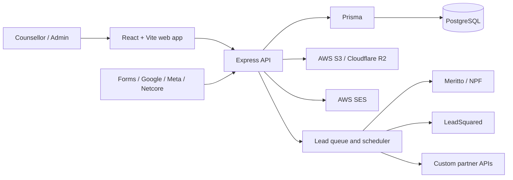
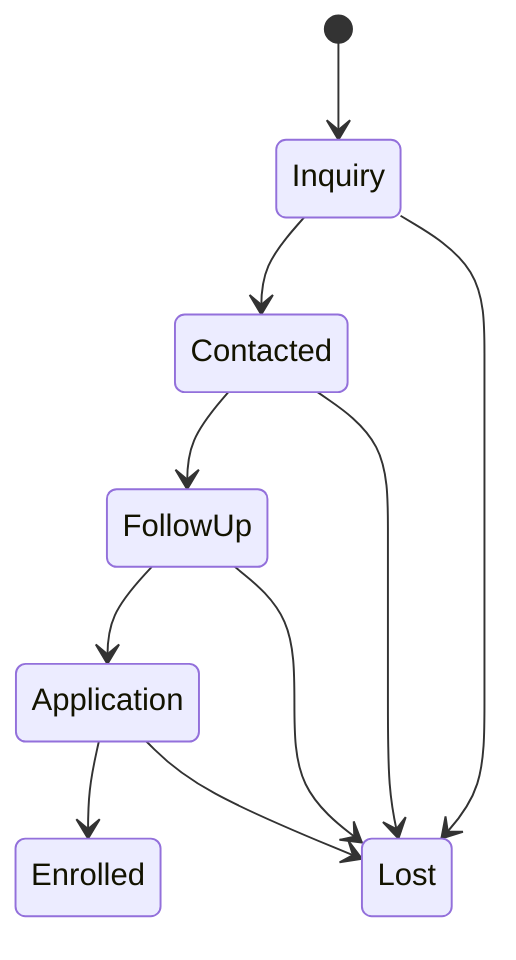

# CRM DC System Wiremap

## Product Map

| Area | Main workflows |
| --- | --- |
| Dashboard | Admissions funnel, lead activity, campaign health, team pulse |
| Lead Push | University setup, CSV/single lead upload, mapping, queues, scheduling, retries, API logs, purge |
| Leads Manager | Saved views, filters, columns, table/Kanban, scoring, favourites, assignment, stages, activity timeline, import/export |
| Opportunity | Configurable pipeline stages and movement |
| Calendar / Activity | Follow-ups, tasks, calls, notes, scheduled activity |
| Marketing | Campaigns, recipients, sequences, workflows, templates, integrations, delivery events |
| Reports | Stage/source/owner conversion, activity, API health, export |
| URL Shortener | Link creation, domains, health, click tracking, API access, bulk imports |
| Access Control | OTP login, approvals, roles, granular permissions, revocation |
| Settings | Fields, toggles, university master data, integrations, database import/export |

## Lead Lifecycle

Every partner delivery records the input snapshot, status, HTTP response, source attribution, university, batch, and time. Automatic partner retries are intentionally disabled because a timed-out request may already have been accepted.
