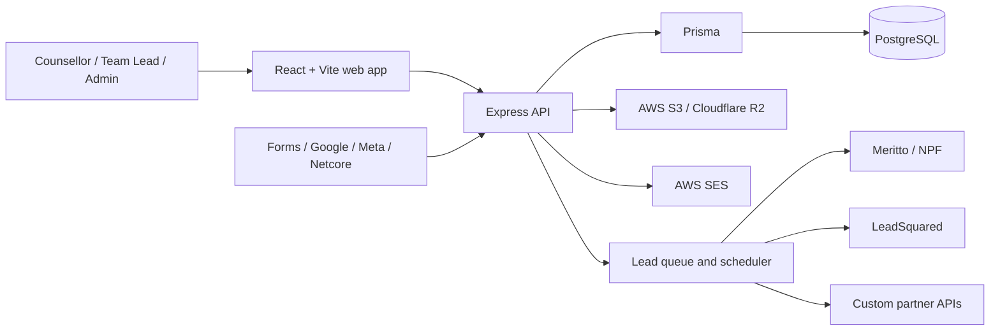
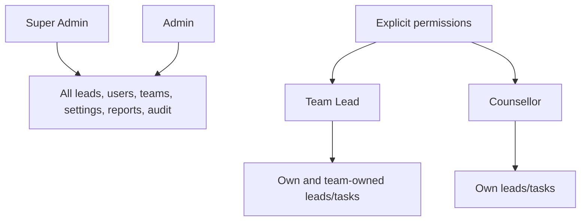
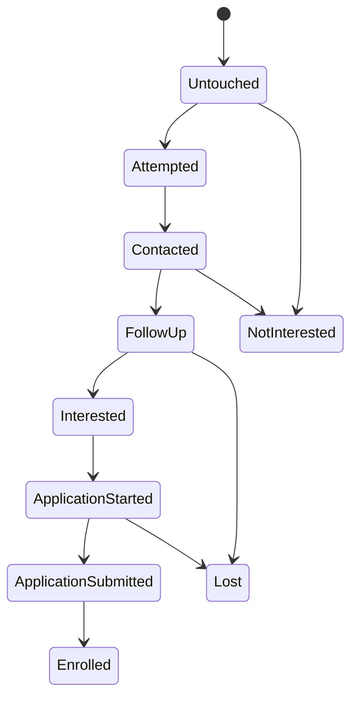

# CRM DC System Wiremap

## Product Map

| Area | Main workflows |
| --- | --- |
| Dashboard | Lead totals, new/untouched/overdue counts, acquisition trend, pipeline, upcoming tasks, recent activity |
| Lead Push | University setup, CSV/single lead upload, mapping, queues, scheduling, retries, API logs, purge |
| Leads Manager | Saved views, quick/advanced filters, configurable columns, scoring, favourites, assignment, stages, detail drawer, CSV import/export |
| Opportunity | Configurable pipeline stages and drag-and-drop stage movement |
| Calendar / Activity | Follow-ups, tasks, calls, email, WhatsApp, meetings, notes, and completion history |
| Reports | Date-scoped stage/source/owner conversion, communication activity, task completion, and CSV export |
| Access Control | Password/OTP login, approvals, four roles, granular permissions, team scope, session revocation |
| Settings | Pipeline stage ordering/defaults/colors, teams, managers, and activation status |
| Audit | Searchable actor/action/resource ledger for lead, task, assignment, user, team, and setup changes |

## Application Routes

| Route | Surface |
| --- | --- |
| `/crm/dashboard` | Operational dashboard |
| `/crm/lead-management` | Lead table, filters, bulk actions, and lead detail |
| `/crm/opportunities` | Pipeline board |
| `/crm/tasks` | Task and follow-up queue |
| `/crm/activities` | Communication timeline |
| `/crm/analytics` | Reports and export |
| `/crm/users` | Users, roles, teams, and permissions |
| `/crm/audit` | Audit ledger |
| `/crm/settings` | Stages and teams |
| `/lead-push/*` | Preserved university lead-delivery module |

## Ownership And Access

## Lead Lifecycle

Every partner delivery records the input snapshot, status, HTTP response, source attribution, university, batch, and time. Automatic partner retries are intentionally disabled because a timed-out request may already have been accepted.
